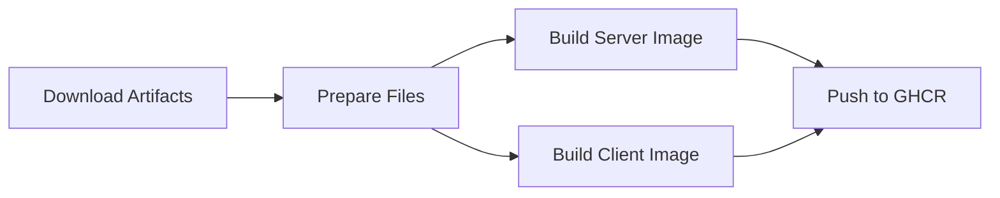

# 🚀 CI/CD Pipeline - R-Type Project

Ce document décrit le pipeline CI/CD complet du projet R-Type utilisant GitHub Actions.

## 📋 Vue d'ensemble

Le pipeline se compose de **3 jobs principaux** :

1. **🔨 Build & Test** : Compilation et tests unitaires
2. **🐳 Docker Build & Push** : Création et publication des images Docker
3. **📢 Notify** : Notifications de statut

## 🔄 Workflow

```
┌─────────────┐
│   Push/PR   │
└──────┬──────┘
       │
       ▼
┌─────────────────────────┐
│  Build & Test (Ubuntu)  │
│  - Install dependencies │
│  - Compile with CMake   │
│  - Run tests           │
│  - Upload artifacts     │
└──────────┬──────────────┘
           │ (success)
           ▼
┌─────────────────────────┐
│  Docker Build & Push    │
│  - Download artifacts   │
│  - Build Server image   │
│  - Build Client image   │
│  - Push to GHCR        │
└──────────┬──────────────┘
           │
           ▼
┌─────────────────────────┐
│     Notifications       │
│  - Summary report       │
│  - Status badges        │
└─────────────────────────┘
```

## 🎯 Déclenchement

Le pipeline se déclenche automatiquement sur :

- ✅ **Push** sur les branches : `main`, `dev`, `develop`
- ✅ **Pull Request** vers `main`
- ✅ **Déclenchement manuel** via l'interface GitHub Actions

## 🔨 Job 1 : Build & Test

### Environnement
- **OS** : Ubuntu 22.04
- **Compiler** : g++ (C++17)
- **Build System** : CMake + Ninja
- **Package Manager** : Conan 2.0

### Étapes détaillées

1. **Checkout du code**
   ```yaml
   - uses: actions/checkout@v4
   ```

2. **Installation des dépendances système**
   - CMake, g++, Ninja
   - Bibliothèques SFML (OpenGL, X11, etc.)
   - Boost libraries

3. **Configuration Conan**
   ```bash
   pip3 install conan==2.0.17
   conan profile detect
   conan install .. --build=missing
   ```

4. **Compilation CMake**
   ```bash
   cmake -B build -DCMAKE_BUILD_TYPE=Release
   cmake --build build -j $(nproc)
   ```

5. **Vérification des binaires**
   - `r-type_server`
   - `r-type_client`
   - `rtype_game`
   - Plugins `.so` dans `LibEngine/Systems/`

6. **Upload des artifacts**
   - Binaires compilés
   - Assets
   - Plugins
   - Rétention : 7 jours

### Artifacts produits

```
rtype-binaries-{SHA}/
├── r-type_server
├── r-type_client
├── rtype_game
├── LibEngine/Systems/*.so
└── Assets/**/*
```

## 🐳 Job 2 : Docker Build & Push

**Condition** : Succès du Job 1 + Push sur `main` ou `dev`

### Images créées

#### 🖥️ Image Serveur
- **Base** : Ubuntu 22.04
- **Taille** : ~200 MB
- **Port** : 4242, 8080
- **Registry** : `ghcr.io/{owner}/{repo}/rtype-server`
- **Tags** :
  - `latest` (sur main)
  - `{branch}` (nom de la branche)
  - `{branch}-{sha}` (commit hash)

#### 🎮 Image Client
- **Base** : Ubuntu 22.04 + SFML
- **Taille** : ~300 MB
- **Display** : X11 forwarding requis
- **Registry** : `ghcr.io/{owner}/{repo}/rtype-client`
- **Tags** : (identiques au serveur)

### Processus de build



### Authentication

Le pipeline utilise automatiquement `GITHUB_TOKEN` pour :
- ✅ Pull/Push vers GitHub Container Registry
- ✅ Permissions : `contents:read`, `packages:write`

## 📊 Job 3 : Notifications

Ce job s'exécute **toujours** (même en cas d'échec) et :

- ✅ Affiche le statut du build
- ✅ Affiche le statut du déploiement Docker
- ✅ Génère un résumé dans GitHub Actions
- ❌ Échoue si le build a échoué

## 🚀 Utilisation

### 1️⃣ Développement local

```bash
# Compiler localement
mkdir build && cd build
conan install .. --build=missing
cmake .. -DCMAKE_BUILD_TYPE=Release
cmake --build . -j

# Tester
./r-type_server --help
./r-type_client --help
```

### 2️⃣ Déclencher le pipeline

```bash
# Méthode 1 : Push sur une branche surveillée
git add .
git commit -m "feat: nouvelle fonctionnalité"
git push origin main

# Méthode 2 : Via l'interface GitHub
# Actions > CI/CD Pipeline > Run workflow
```

### 3️⃣ Utiliser les images Docker

```bash
# Pull depuis GitHub Container Registry
docker pull ghcr.io/epitechpge3-2025/g-cpp-500-cot-5-1-rtype-2/rtype-server:latest

# Lancer le serveur
docker run -d -p 4242:4242 \
  ghcr.io/epitechpge3-2025/g-cpp-500-cot-5-1-rtype-2/rtype-server:latest
```

## 📈 Monitoring

### Via GitHub Actions UI

1. Accédez à **Actions** dans le repository
2. Sélectionnez le workflow **"R-Type CI/CD Pipeline"**
3. Visualisez :
   - ✅ Status de chaque job
   - 📊 Temps d'exécution
   - 📦 Artifacts disponibles
   - 📝 Logs détaillés

### Badges de statut

Ajoutez ces badges dans votre README :

```markdown

```

### Consulter les images Docker

```bash
# Lister les tags disponibles
docker image ls | grep rtype

# Inspecter une image
docker inspect ghcr.io/epitechpge3-2025/g-cpp-500-cot-5-1-rtype-2/rtype-server:latest
```

## 🔧 Configuration

### Variables d'environnement

Définies dans `.github/workflows/build.yaml` :

```yaml
env:
  BUILD_TYPE: Release
  CONAN_VERSION: 2.0.17
```

### Secrets requis

- **`GITHUB_TOKEN`** : Fourni automatiquement par GitHub Actions

### Permissions

Le workflow nécessite :
```yaml
permissions:
  contents: read    # Lire le code
  packages: write   # Publier les images Docker
```

## 🐛 Troubleshooting

### ❌ Build échoue

1. **Vérifier les logs**
   ```bash
   # Dans GitHub Actions > Workflow run > Build & Test
   ```

2. **Dépendances manquantes**
   - Vérifier `conanfile.txt`
   - Vérifier les paquets apt installés

3. **Erreurs de compilation**
   - Vérifier C++17 compatibility
   - Vérifier les includes manquants

### ❌ Docker build échoue

1. **Artifacts manquants**
   - Vérifier que le Job 1 a réussi
   - Vérifier l'upload d'artifacts

2. **Permissions GHCR**
   - Vérifier les permissions du repository
   - Settings > Packages > Package settings

### ❌ Tests échouent

1. **Tester localement**
   ```bash
   ./r-type_server --help
   timeout 5 ./r-type_server
   ```

2. **Vérifier les dépendances runtime**

## 📚 Fichiers du pipeline

```
.github/workflows/
└── build.yaml                 # Pipeline principal

docker/
├── Dockerfile.server          # Image serveur
├── Dockerfile.client          # Image client
├── docker-compose.yml         # Orchestration
└── README.md                  # Documentation Docker

.dockerignore                  # Exclusions Docker
```

## 🎯 Optimisations

### Cache Docker Layers

Le pipeline utilise GitHub Actions Cache :
```yaml
cache-from: type=gha
cache-to: type=gha,mode=max
```

**Avantages** :
- ⚡ Builds plus rapides (2-3x)
- 💰 Réduction du temps de build
- 🔄 Réutilisation des layers Docker

### Build parallèle

```yaml
cmake --build build -j $(nproc)
```

Utilise tous les cœurs CPU disponibles.

### Artifacts retention

```yaml
retention-days: 7
```

Les artifacts sont conservés 7 jours pour économiser l'espace.

## 📝 Checklist avant push

- [ ] Code compile localement
- [ ] Tests passent
- [ ] Pas de fichiers secrets/credentials
- [ ] `.gitignore` à jour
- [ ] Documentation mise à jour
- [ ] Commit message clair

## 🔗 Liens utiles

- [GitHub Actions Documentation](https://docs.github.com/actions)
- [Docker Documentation](https://docs.docker.com/)
- [Conan Package Manager](https://conan.io/center/)
- [CMake Documentation](https://cmake.org/documentation/)

## 📧 Support

En cas de problème :
1. Consultez les logs GitHub Actions
2. Vérifiez la documentation Docker
3. Ouvrez une issue sur GitHub

---

**Dernière mise à jour** : Novembre 2025
**Version du pipeline** : 1.0.0
